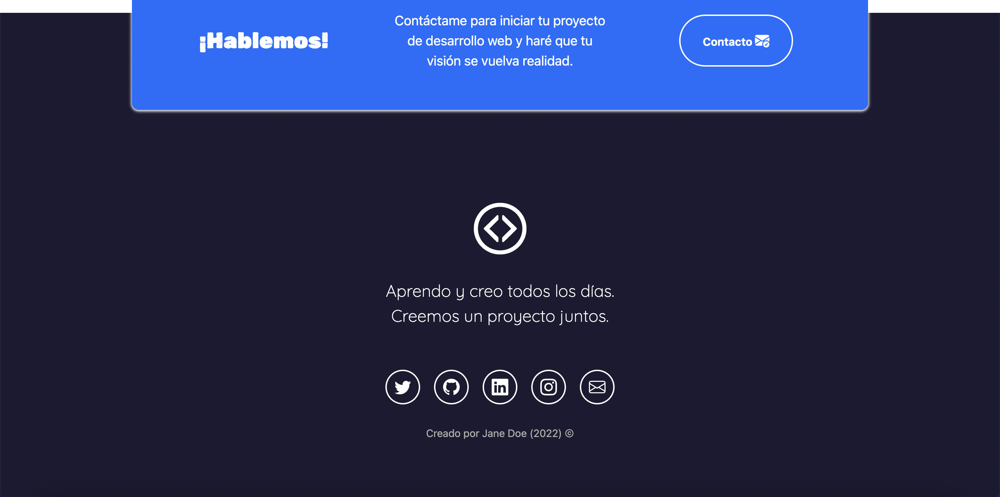

# Portafolio Adaptable (Responsive) con Bootstrap 5

Este proyecto creado para el bootcamp Tecnolochicas PRO, es una página web adaptable a dispositivos de distintos tamaños (este tipo de sitio web se conoce en inglés como "responsive"). 

El propósito de esta página web es mostrar el portafolio de proyectos de un(a) desarrollador(a) y su experiencia. Incluye una descripción breve de su motivación, experiencia, proyectos, artículos publicados y formas de contacto. 

También incluye imágenes alternativas en la carpeta `imagenes` en caso de que se desee personalizar la imagen principal del desarrollador, además de animación a la escritura de la página web con JavaScript.

### Capturas de pantalla:

Primera parte de la página web:

Experiencia:

Proyectos:

Testimonios:

Contacto:

## Tecnologías

Esta página web fue creada con:

* HTML
* CSS
* JavaScript 
* Bootstrap 5

Además, se incluyeron **Google Fonts** para personalizar la fuente y **Bootstrap icons** para incorporar íconos como flechas y logos de redes sociales populares. 

## Español

License 📜
MIT License

Copyright (c) [2023] [Mayleni Chela Magallón]

Permission is hereby granted, free of charge, to any person obtaining a copy of this software and associated documentation files (the "Software"), to deal in the Software without restriction, including without limitation the rights to use, copy, modify, merge, publish, distribute, sublicense, and/or sell copies of the Software, and to permit persons to whom the Software is furnished to do so, subject to the following conditions:

The above copyright notice and this permission notice shall be included in all copies or substantial portions of the Software.

THE SOFTWARE IS PROVIDED "AS IS", WITHOUT WARRANTY OF ANY KIND, EXPRESS OR IMPLIED, INCLUDING BUT NOT LIMITED TO THE WARRANTIES OF MERCHANTABILITY, FITNESS FOR A PARTICULAR PURPOSE AND NONINFRINGEMENT. IN NO EVENT SHALL THE AUTHORS OR COPYRIGHT HOLDERS BE LIABLE FOR ANY CLAIM, DAMAGES OR OTHER LIABILITY, WHETHER IN AN ACTION OF CONTRACT, TORT OR OTHERWISE, ARISING FROM, OUT OF OR IN CONNECTION WITH THE SOFTWARE OR THE USE OR OTHER DEALINGS IN THE SOFTWARE.

El texto de la página web está escrito en español, al igual que las clases y atributos personalizados. Las clases relacionadas con Bootstrap se incluyeron en inglés.

